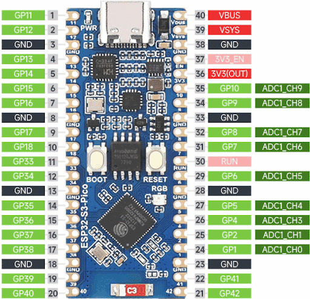
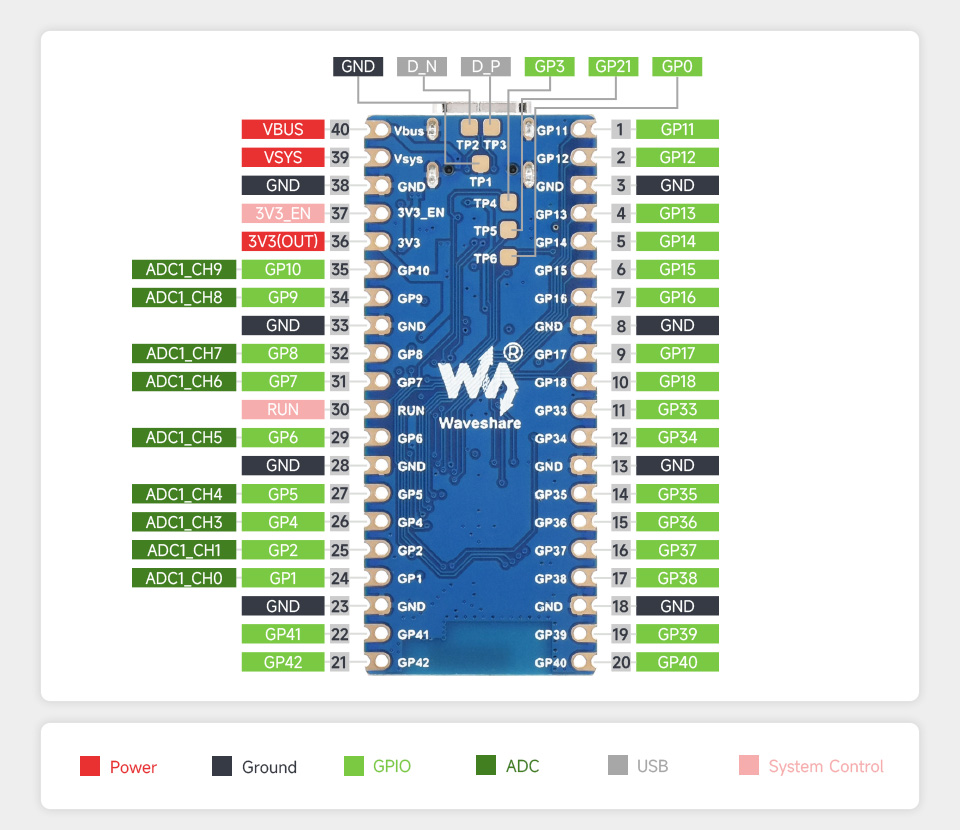

# MicroPython Course — ESP32-S3 Pico

A hands-on programming course for the **ESP32-S3** microcontroller using **MicroPython**. Each lesson is a separate sketch — a program uploaded directly to the board. Lessons are ordered from simplest to more advanced, gradually introducing new electronic components and programming techniques.

---

## Prerequisites

- **ESP32-S3 Pico** board with MicroPython firmware flashed
- **MyCastle** environment (or any REPL client e.g. Thonny / mpremote)
- Basic knowledge of Python (variables, loops, conditionals)

---

## Glossary

| Term | Description |
| ---- | ----------- |
| **GPIO** | General Purpose Input/Output — a microcontroller pin that can act as a digital input or output |
| **Pin.OUT** | Output mode — the microcontroller drives the voltage (0 V or 3.3 V) |
| **Pin.IN** | Input mode — the microcontroller reads the state of an external signal |
| **ADC** | Analog-to-Digital Converter — converts a voltage (0–3.3 V) into an integer value |
| **ATTN_11DB** | ADC attenuation setting that allows measuring voltages up to ~3.9 V instead of the default ~1.1 V |
| **LED** | Light Emitting Diode — emits light when current flows through it |
| **Current-limiting resistor** | A resistor in series with an LED that prevents it from burning out — typically 220–330 Ω |
| **Tactile button** | A mechanical switch that closes a circuit when pressed |
| **Pull-down resistor** | A resistor (usually 10 kΩ) connecting a pin to GND, ensuring a LOW state when the button is released |
| **LDR (photoresistor)** | Light Dependent Resistor — resistance decreases as light increases; darker = higher resistance |
| **Voltage divider** | Two resistors in series between power and GND; the voltage at their junction is proportional to the ratio of their values |
| **DHT11** | Digital temperature and humidity sensor — communicates over a single-wire protocol; built-in MicroPython `dht` module handles the protocol automatically |
| **HC-SR04** | Ultrasonic distance sensor — emits a 40 kHz burst and measures the echo travel time to calculate distance (2–400 cm range) |
| **PIR sensor** | Passive Infrared sensor — detects movement by sensing changes in infrared radiation emitted by warm objects; output goes HIGH on motion |
| **TRIG** | Trigger pin of HC-SR04 — a 10 µs HIGH pulse starts a measurement |
| **ECHO** | Echo pin of HC-SR04 — remains HIGH for a duration proportional to the measured distance |
| **time_pulse_us()** | MicroPython function that measures the duration (in µs) of a pulse on a pin |
| **setup()** | Initialization function called once at program start |
| **loop()** | Main loop function called repeatedly |
| **sleep_ms(n)** | Pauses program execution for *n* milliseconds |
| **REPL** | Read-Eval-Print Loop — the interactive MicroPython console |

---

## Microcontroller Pinout





## Pin Overview

| Pin | Mode | Component | Lessons |
| --- | ---- | --------- | ------- |
| 3 | Digital in/out | DHT11 DATA | Lesson 12 |
| 4 | Digital input | PIR motion sensor (OUT) | Lesson 11 |
| 4 | Digital output | ULN2003 IN1 (stepper motor) | Lesson 8 |
| 5 | Digital output | ULN2003 IN2 (stepper motor) | Lesson 8 |
| 5 | Digital output | HC-SR04 TRIG | Lesson 10 |
| 6 | Digital output | ULN2003 IN3 (stepper motor) | Lesson 8 |
| 4 | Digital input | HC-SR04 ECHO | Lesson 10 |
| 7 | ADC input | Photoresistor (LDR) | Lesson 6 |
| 19 | Digital input | VS1838B IR receiver (data) | Lesson 5 |
| 11 | Digital output | LED | Lesson 1, 2, 4 |
| 12 | Digital output | LED (red) | Lesson 3 |
| 13 | Digital output | LED (yellow) | Lesson 3 |
| 14 | Digital output | LED (green) | Lesson 3 |
| 16 | Digital input | Tactile button | Lesson 4 |
| 17 | Digital output | ULN2003 IN4 (stepper motor) | Lesson 8 |
| 18 | PWM output | Passive buzzer | Lesson 9 |

---

## Wiring Diagrams

### LED connection (Lessons 1, 2, 4)

```text
ESP32-S3 Pico
┌──────────────┐
│         GND  ├──────────────────────────────────┐
│              │                                  │
│        GP11  ├──[ R 330Ω ]──┤▶├──(cathode)    GND
│              │               LED    (anode → R)
└──────────────┘
```

> **Important:** Always connect an LED through a current-limiting resistor (220–330 Ω). Without it, the current may exceed the safe limit and damage both the LED and the GPIO pin.

Practical view:

```text
GP11 ──── 330Ω resistor ──── LED anode (+)
                                   │
                              LED cathode (−)
                                   │
GND ───────────────────────────────┘
```

---

### Three LEDs connection (Lesson 3)

```text
GP14 ── R 330Ω ──┤▶├── GND    (green)
GP13 ── R 330Ω ──┤▶├── GND    (yellow)
GP12 ── R 330Ω ──┤▶├── GND    (red)
```

Timing diagram:

```text
Green  (GP14) ─── 3 s ON ─── OFF ───────────────────────────▶
Yellow (GP13) ───────────── 1 s ON ─── OFF ─────────────────▶
Red    (GP12) ──────────────────────── 3 s ON ─── OFF ──────▶
              0s              3s         4s          7s   ...
```

---

### Button connection (Lesson 4)

```text
3.3 V ──── Button ──── GP16
                  │
              R 10kΩ (pull-down)
                  │
                 GND
```

Button **released**: GP16 pulled to GND through resistor → LOW (0)
Button **pressed**: GP16 connected to 3.3 V → HIGH (1)

```text
               ┌─────────┐
3V3 ──[BTN]──┤  GP16   │  ESP32-S3
              │         │
             [10kΩ]     │
              │         │
GND ──────────┘         │
                        │
                   read .value()
```

---

### IR receiver — VS1838B (Lesson 5)

```text
VS1838B (front view — flat side facing you)
┌─────────────┐
│  ○   ○   ○  │
│  │   │   │  │
│ OUT  GND  VCC│
│  │   │   │  │
│  │   │   │  │
  GP19  GND  3V3
```

> **VS1838B pinout** (flat side facing you, pins down): left = OUT (signal), middle = GND, right = VCC (3.3 V).

```text
ESP32-S3 Pico
┌──────────────┐
│        GP19  ├──── OUT  (VS1838B left pin)
│         3V3  ├──── VCC  (VS1838B right pin)
│         GND  ├──── GND  (VS1838B middle pin)
└──────────────┘
```

> **No extra resistor or capacitor needed** — the VS1838B module has internal filtering and a 3.3 V-compatible output that connects directly to any GPIO input pin.

---

### Photoresistor — voltage divider (Lesson 6)

```text
3.3 V ──── LDR (photoresistor) ──┬──── GP7 (ADC)
                                 │
                             R 10kΩ (fixed)
                                 │
                                GND
```

How it works: the LDR and fixed resistor form a voltage divider. In the **dark**, LDR resistance rises → voltage at GP7 drops → low ADC reading. In **bright light**, LDR resistance falls → voltage at GP7 rises → high ADC reading.

```text
Light level:  │░░░░░░░░░│▒▒▒▒▒▒▒▒▒│█████████│
ADC reading:  0       1000       2500      4095
Category:    DARK     NORMAL      BRIGHT
```

---

### Passive buzzer connection (Lesson 9)

```text
ESP32-S3 Pico
┌──────────────┐
│        GP18  ├──── (+) Buzzer (−) ──── GND
│         GND  ├──────────────────────────┘
└──────────────┘
```

> **Passive vs active buzzer:** A **passive** buzzer has no internal oscillator — it needs a PWM signal to vibrate at a specific frequency (pitch). An **active** buzzer has an internal oscillator and only needs power to beep. Lesson 9 uses a **passive** buzzer so you can control the pitch via PWM. No resistor is needed — the buzzer's internal coil already limits current.

```text
GP18 ──── (+) terminal of passive buzzer
GND  ──── (−) terminal of passive buzzer
```

---

### DHT11 temperature and humidity sensor (Lesson 12)

```text
ESP32-S3 Pico        DHT11 module
┌──────────────┐    ┌──────────────┐
│         3V3  ├────┤ VCC (+)      │
│         GND  ├────┤ GND (−)      │
│         GP3  ├────┤ DATA (S)     │
└──────────────┘    └──────────────┘
```

> **Pull-up resistor:** The DHT11 DATA line requires a 4.7–10 kΩ pull-up to 3.3 V. Most breakout modules already include it on the board. If you use a bare sensor (4-pin package), add a 10 kΩ resistor between DATA and 3.3 V.
> **Minimum interval:** Do not call `measure()` more often than once every 1 second (recommended 2 s). Faster polling returns stale or erroneous values.

**Bare sensor vs module:**

```text
Bare DHT11 (4 pins, left to right — flat side facing you):
  Pin 1 → VCC (3.3 V)
  Pin 2 → DATA  ──[ 10kΩ ]── VCC
  Pin 3 → NC (not connected)
  Pin 4 → GND
```

---

### HC-SR04 ultrasonic distance sensor (Lesson 10)

```text
ESP32-S3 Pico        HC-SR04
┌──────────────┐    ┌─────────┐
│         3V3  ├────┤ VCC     │
│         GND  ├────┤ GND     │
│         GP5  ├────┤ TRIG    │
│         GP4  ├────┤ ECHO    │
└──────────────┘    └─────────┘
```

> **Voltage note:** The HC-SR04 operates at 5 V but its ECHO pin outputs 5 V logic. On a 3.3 V board like the ESP32-S3, power the module from 3.3 V — this also lowers the ECHO output to ~3.3 V, which is safe to connect directly to a GPIO input pin.

**How it works:**

```text
   TRIG: ──┐ 10 µs ┌──────────────────────────────── LOW
           └───────┘

   ECHO: ────────────────┐          ┌─────────────────── LOW
                         │←────────→│
                         │ duration │ = distance × 2 / 343 m/s
                         └──────────┘
         HIGH when echo received

   distance [cm] = duration [µs] / 58
```

---

### PIR motion sensor (Lesson 11)

```text
ESP32-S3 Pico        PIR module
┌──────────────┐    ┌──────────────┐
│         3V3  ├────┤ VCC          │
│         GND  ├────┤ GND          │
│         GP4  ├────┤ OUT (signal) │
└──────────────┘    └──────────────┘

GP11 ──── 330Ω ──── LED (+) ──── LED (−) ──── GND
```

> **Most PIR modules** (e.g. HC-SR501) accept 5 V or 3.3 V and output a 3.3 V-compatible HIGH signal — they can be connected directly to any GPIO input pin. Check your module's datasheet.

**Behavior:**

```text
No motion:   OUT ── LOW  (0 V)
Motion:      OUT ── HIGH (3.3 V)  for 2–10 s (adjustable via onboard potentiometer)
```

---

## Breadboard Wiring Guide

### How a breadboard works

A breadboard lets you build circuits without soldering. Components and wires plug into holes that are connected internally in a fixed pattern.

```text
       Columns →
       a    b    c    d    e    GAP    f    g    h    i    j
  1  [ ]──[ ]──[ ]──[ ]──[ ]         [ ]──[ ]──[ ]──[ ]──[ ]
  2  [ ]──[ ]──[ ]──[ ]──[ ]         [ ]──[ ]──[ ]──[ ]──[ ]
  3  [ ]──[ ]──[ ]──[ ]──[ ]         [ ]──[ ]──[ ]──[ ]──[ ]
  4  [ ]──[ ]──[ ]──[ ]──[ ]         [ ]──[ ]──[ ]──[ ]──[ ]
  5  [ ]──[ ]──[ ]──[ ]──[ ]         [ ]──[ ]──[ ]──[ ]──[ ]
R
o
w
s
↓
```

**Rules:**

- All 5 holes in the same **row** on one side (a–e or f–j) are **connected** to each other
- The **gap** in the middle separates the two halves — no connection across it
- Holes in the same **column** but different rows are **not** connected
- The **+** and **−** rails running along the long edges are each one continuous wire — use them for 3.3 V and GND

```text
+ ════════════════════════════════════════════════ +  ← all connected (3.3 V)
- ════════════════════════════════════════════════ -  ← all connected (GND)

  a   b   c   d   e       f   g   h   i   j
[ ]─[ ]─[ ]─[ ]─[ ]   [ ]─[ ]─[ ]─[ ]─[ ]   row 1
[ ]─[ ]─[ ]─[ ]─[ ]   [ ]─[ ]─[ ]─[ ]─[ ]   row 2
[ ]─[ ]─[ ]─[ ]─[ ]   [ ]─[ ]─[ ]─[ ]─[ ]   row 3
```

> **Tip:** Use a short wire (jumper) from the ESP32-S3 `3V3` pin to the `+` rail, and from `GND` to the `−` rail. Then use those rails as your power source throughout the board.

---

### LED + resistor on breadboard (Lessons 1, 2, 4)

**Components needed:**

- 1× LED (any color)
- 1× resistor 330 Ω (orange–orange–brown stripes)
- 2× jumper wire (male-to-male)

**Identifying LED legs:**

```text
      Anode (+)   Cathode (−)
          │            │
          │            │
         longer       shorter
          leg          leg
           \          /
            \        /
             [  LED  ]
                │
          flat side = cathode (−)
```

**Step-by-step breadboard layout:**

```text
+ ══════════════════════════════ +
- ══════════════════════════════ -

      a     b     c     d     e
 5  [GP11]─[GP11]─[ ]──[ ]──[ ]     ← wire from GP11 lands here (e.g. row 5a)
 6  [RES ]─[RES ]─[ ]──[ ]──[ ]     ← resistor: one leg in 5a, other leg in 6a
 7  [LED+]─[LED+]─[ ]──[ ]──[ ]     ← LED anode (+, longer leg) in 6a, cathode in 7a
 8  [GND ]─[GND ]─[ ]──[ ]──[ ]     ← wire from 7a to − rail
```

Clearer layout (each row = one breadboard row, letters = columns):

```text
        a        b        c        d        e
 1    [===]    [   ]    [   ]    [   ]    [   ]    ← 1a: wire from GP11
 2    [===]    [   ]    [   ]    [   ]    [   ]    ← 2a: resistor leg 1
 3    [===]    [   ]    [   ]    [   ]    [   ]    ← 3a: resistor leg 2 + LED anode (+)
 4    [===]    [   ]    [   ]    [   ]    [   ]    ← 4a: LED cathode (−)
 5    [===]    [   ]    [   ]    [   ]    [   ]    ← 5a: wire to GND rail

 Connections:
   GP11 pin  →  wire  →  row 1a
   row 1a    ────────────  row 2a   (same row: connected)
   row 2a  ──[330Ω]──  row 3a
   row 3a  ──  LED anode (+, long leg)  ──  row 4a  (LED cathode, short leg)
   row 4a    →  wire  →  − rail (GND)
```

**Actual connection sequence:**

```text
Step 1: plug a jumper wire from ESP32-S3 GP11 → breadboard row 1, column a
Step 2: insert resistor (330 Ω) between row 1a and row 3a
        (resistor spans 2 rows — that's fine, it bridges them)
Step 3: insert LED — long leg (anode +) into row 3a,
                     short leg (cathode −) into row 4a
Step 4: plug a jumper wire from row 4a → − (GND) rail
Step 5: connect ESP32-S3 GND pin → − rail  (if not done already)
```

**Side view (one column):**

```text
GP11 ──wire──[row 1]──[330Ω]──[row 3]──LED+  LED−──[row 4]──wire── GND rail
```

---

### Three LEDs on breadboard (Lesson 3)

**Components needed:**

- 3× LED (green, yellow, red)
- 3× resistor 330 Ω
- 6× jumper wire

Each LED + resistor pair follows the same pattern as above, placed on separate rows:

```text
        a         b         c         d         e
  1   [GP14]    [   ]    [   ]    [   ]    [   ]   ← wire from GP14
  2   [ R  ]    [   ]    [   ]    [   ]    [   ]   ← 330 Ω resistor
  3   [LED+]    [   ]    [   ]    [   ]    [   ]   ← green LED anode
  4   [LED−]────────────────────────────────wire──► GND rail

  6   [GP13]    [   ]    [   ]    [   ]    [   ]   ← wire from GP13
  7   [ R  ]    [   ]    [   ]    [   ]    [   ]   ← 330 Ω resistor
  8   [LED+]    [   ]    [   ]    [   ]    [   ]   ← yellow LED anode
  9   [LED−]────────────────────────────────wire──► GND rail

 11   [GP12]    [   ]    [   ]    [   ]    [   ]   ← wire from GP12
 12   [ R  ]    [   ]    [   ]    [   ]    [   ]   ← 330 Ω resistor
 13   [LED+]    [   ]    [   ]    [   ]    [   ]   ← red LED anode
 14   [LED−]────────────────────────────────wire──► GND rail
```

> Leave a gap of at least one empty row between each LED group to avoid accidentally connecting components.

---

### Tactile button on breadboard (Lesson 4)

**Understanding the button legs:**

A tactile (push) button has 4 legs arranged in two pairs. The two legs on the **same side** are always connected internally. Pressing the button connects the **left pair** to the **right pair**.

```text
     Top view of button

     leg A ──┐     ┌── leg C
             │     │
     leg B ──┘     └── leg D
      (A─B always connected)  (C─D always connected)
      pressing button connects A/B to C/D
```

**Orienting on the breadboard:**

Place the button so it **straddles the centre gap** — one pair of legs on the left half (columns a–e), the other pair on the right half (columns f–j). This way the two sides are only connected when the button is pressed.

```text
         a    b    c    d    e         f    g    h    i    j
  5    [   ] [   ] [A ] [   ] [   ] | [C ] [   ] [   ] [   ] [   ]
  6    [   ] [   ] [B ] [   ] [   ] | [D ] [   ] [   ] [   ] [   ]
                    ↑                   ↑
               left pair            right pair
               (A─B joined)         (C─D joined)
               press → A─B─C─D all joined
```

**Full button + pull-down resistor layout:**

```text
        a     b     c     d     e           f     g     h     i     j
  5   [   ] [   ] [ A ] [   ] [   ]  |  [ C ] [   ] [   ] [   ] [   ]
  6   [   ] [   ] [ B ] [   ] [   ]  |  [ D ] [   ] [   ] [   ] [   ]

  Connections:
   3.3V rail  →  wire  →  row 5c  (leg A / left-top of button)
   row 6c  (leg B / left-bottom)  →  wire  →  GP16
   row 6c                         →  10 kΩ  →  GND rail   (pull-down)
```

**Step-by-step:**

```text
Step 1: press button into breadboard so it straddles the centre gap
        left legs in columns c (rows 5 and 6), right legs in column f (rows 5 and 6)
Step 2: wire from + rail (3.3 V) → row 5c  (top-left leg of button)
Step 3: wire from row 6c         → GP16 on ESP32-S3
Step 4: insert 10 kΩ resistor between row 6c and − rail (GND)
        this is the pull-down — it keeps GP16 LOW when button is not pressed
Step 5: connect ESP32-S3 3V3 → + rail,  GND → − rail  (if not done)
```

**Signal logic:**

```text
Button released:  3.3V ──[BTN open]── GP16 ──[10kΩ]── GND   → GP16 reads 0
Button pressed:   3.3V ──[BTN closed]─ GP16 ──[10kΩ]── GND  → GP16 reads 1
```

> **Why pull-down?** Without the resistor, GP16 would be "floating" when the button is released — it could read random 0s and 1s from electrical noise. The pull-down resistor anchors it firmly to 0 (LOW).

---

## Communication Protocols

Modern microcontrollers like ESP32-S3 communicate with sensors, displays, and other peripherals using standard serial protocols. The three most common are **UART**, **SPI**, and **I2C**. Each has different wiring, speed, and use cases.

---

### UART — Universal Asynchronous Receiver-Transmitter

UART is the simplest serial protocol — two devices talk directly to each other using just two wires.

**Wires:**

| Signal | Direction | Description |
| ------ | --------- | ----------- |
| TX | → | Transmit — data sent by this device |
| RX | ← | Receive — data received by this device |
| GND | — | Common ground (always required) |

**Key rules:**

- TX of one device connects to RX of the other (cross-wired)
- Both sides must agree on the same **baud rate** (e.g. 9600, 115200 bps)
- No clock wire — timing is derived from the agreed baud rate
- Point-to-point only: one sender, one receiver

```text
ESP32-S3                Peripheral
  TX  ────────────────►  RX
  RX  ◄────────────────  TX
  GND ─────────────────  GND
```

**Typical use cases:** GPS modules, Bluetooth serial, debug console, communication between two microcontrollers.

**MicroPython example:**

```python
from machine import UART
uart = UART(1, baudrate=9600, tx=17, rx=18)
uart.write('Hello\n')
data = uart.read(32)
```

---

### I2C — Inter-Integrated Circuit

I2C uses only **two wires** and supports **multiple devices** on the same bus. Each device has a unique 7-bit address so the master can address them individually.

**Wires:**

| Signal | Description |
| ------ | ----------- |
| SDA | Serial Data — bidirectional data line |
| SCL | Serial Clock — clock generated by the master |
| GND | Common ground |

**Key rules:**

- One master (ESP32-S3), many slaves (sensors, displays…)
- Both SDA and SCL require **pull-up resistors** to 3.3 V (typically 4.7 kΩ) — many breakout boards include them
- Typical speeds: 100 kHz (standard), 400 kHz (fast)
- Each slave has a fixed address (printed in its datasheet, e.g. `0x3C` for SSD1306 OLED)

```text
ESP32-S3        Sensor A       Sensor B       Display
  SDA ──────────── SDA ───────── SDA ────────── SDA
  SCL ──────────── SCL ───────── SCL ────────── SCL
  GND ──────────── GND ───────── GND ────────── GND
  3V3 ──[4.7kΩ]── SDA
  3V3 ──[4.7kΩ]── SCL
```

**Typical use cases:** temperature/humidity sensors (DHT, BMP280, SHT31), OLED displays (SSD1306), real-time clocks (DS3231), accelerometers (MPU6050).

**MicroPython example:**

```python
from machine import I2C, Pin
i2c = I2C(0, scl=Pin(22), sda=Pin(21), freq=400_000)
devices = i2c.scan()          # returns list of found addresses
print([hex(d) for d in devices])
data = i2c.readfrom(0x3C, 4) # read 4 bytes from device at address 0x3C
```

---

### SPI — Serial Peripheral Interface

SPI is the fastest of the three protocols. It uses **4 wires** and is full-duplex (sends and receives simultaneously). Like I2C it supports multiple slaves, but each slave needs its own **CS** (Chip Select) wire.

**Wires:**

| Signal | Alternative name | Description |
| ------ | ---------------- | ----------- |
| MOSI | SDO, TX | Master Out Slave In — data from master to slave |
| MISO | SDI, RX | Master In Slave Out — data from slave to master |
| SCK | CLK | Clock — generated by the master |
| CS | SS, CE | Chip Select — one wire per slave, active LOW |

```text
ESP32-S3       Slave A          Slave B
  MOSI ──────── MOSI ─────────── MOSI
  MISO ──────── MISO ─────────── MISO
  SCK  ──────── SCK  ─────────── SCK
  GP10 ──────── CS               (high = inactive)
  GP11 ───────────────────────── CS
  GND  ──────── GND  ─────────── GND
```

**Key rules:**

- No pull-up resistors needed
- Typical speeds: 1–50 MHz (much faster than I2C)
- Each additional slave needs one extra CS pin on the master
- Full-duplex: master and slave exchange data simultaneously

**Typical use cases:** SD card readers, TFT displays (ILI9341, ST7789), flash memory, high-speed sensors.

**MicroPython example:**

```python
from machine import SPI, Pin
spi = SPI(1, baudrate=10_000_000, polarity=0, phase=0,
          sck=Pin(18), mosi=Pin(23), miso=Pin(19))
cs = Pin(10, Pin.OUT, value=1)   # CS idle HIGH

cs.value(0)                      # select slave
spi.write(b'\x9F')               # send command
result = spi.read(3)             # read 3 bytes response
cs.value(1)                      # deselect slave
```

---

### Protocol comparison

| Feature | UART | I2C | SPI |
| ------- | ---- | --- | --- |
| Wires | 2 (+ GND) | 2 (+ GND) | 4 (+ 1 per slave) |
| Max devices | 2 (point-to-point) | ~127 | unlimited (1 CS per slave) |
| Speed | 115 kbps typical | up to 400 kHz | up to 50 MHz |
| Pull-ups needed | No | Yes (4.7 kΩ) | No |
| Full-duplex | No | No | Yes |
| Complexity | Simplest | Medium | Medium |
| Typical use | Debug, GPS, BT | Sensors, OLED | Displays, SD card |

---

## Lessons

Each lesson is shown in two forms: **Blockly blocks** (visual editor) and **MicroPython code** (auto-generated).

---

### Lesson 1 — Turn on an LED

**Goal:** Understand basic pin output configuration and setting a HIGH state once at startup.

**What happens:**
The program configures pin 11 as an output, then in `setup()` sets it HIGH (3.3 V). The LED turns on and stays on for the entire runtime. The `loop()` function is empty — nothing changes after initialization.

**Wiring:** see *LED connection* section, pin GP11.

**Blockly blocks:**

```text
╔══ ▶ START ══════════════════════════════╗
║  [Pin Init]  pin=11  mode=OUT           ║
║  [Pin Set]   pin=11  → 1               ║
║  [Print]     "Led is On"               ║
╚═════════════════════════════════════════╝

╔══ 🔁 FOREVER ═══════════════════════════╗
║  (empty)                                ║
╚═════════════════════════════════════════╝
```

**MicroPython code:**

```python
from machine import Pin

_pin_11 = Pin(11, mode=Pin.OUT)

def setup():
    _pin_11.value(1)
    print('Led is On')

def loop():
    pass
```

**What you learn:**

- Importing the `machine` module
- Creating a `Pin` object in `Pin.OUT` mode
- The `.value(1)` method — setting a HIGH state
- The `setup()` / `loop()` structure

---

### Lesson 2 — Blinking LED

**Goal:** Introduce time delays and cyclic pin state changes.

**What happens:**
The LED on pin 11 turns on for 1 second, then off for 1 second — repeating indefinitely. This produces the classic blinking effect.

**Timing diagram:**

```text
GP11:  ___________         ___________         _____
      |           |       |           |       |
      |   1000ms  |       |   1000ms  |       |
______|           |_______|           |_______|
      ↑ ON        ↑ OFF   ↑ ON        ↑ OFF
```

**Blockly blocks:**

```text
╔══ ▶ START ══════════════════════════════╗
║  [Pin Init]  pin=11  mode=OUT           ║
╚═════════════════════════════════════════╝

╔══ 🔁 FOREVER ═══════════════════════════╗
║  [Pin Set]   pin=11  → 1               ║
║  [Sleep]     1000 ms                   ║
║  [Pin Set]   pin=11  → 0               ║
║  [Sleep]     1000 ms                   ║
╚═════════════════════════════════════════╝
```

**MicroPython code:**

```python
from machine import Pin
import time

_pin_11 = Pin(11, mode=Pin.OUT)

def setup():
    pass

def loop():
    _pin_11.value(1)
    time.sleep_ms(1000)
    _pin_11.value(0)
    time.sleep_ms(1000)
```

**What you learn:**

- The `time` module and `sleep_ms()` function
- Running code repeatedly in the `loop()` function
- Toggling a pin between 0 and 1

---

### Lesson 3 — Traffic light with three LEDs

**Goal:** Control multiple output pins, sequence with different timings, visually simulate a traffic light.

**What happens:**
Three LEDs turn on one after another in a fixed order:

1. Green (GP14) on for 3 seconds
2. Yellow (GP13) on for 1 second
3. Red (GP12) on for 3 seconds
4. Cycle repeats from step 1

**Wiring:** see *Three LEDs connection* section.

**Blockly blocks:**

```text
╔══ ▶ START ══════════════════════════════╗
║  [Pin Init]  pin=12  mode=OUT           ║
║  [Pin Init]  pin=13  mode=OUT           ║
║  [Pin Init]  pin=14  mode=OUT           ║
╚═════════════════════════════════════════╝

╔══ 🔁 FOREVER ═══════════════════════════╗
║  [Pin Set]   pin=14  → 1   (green)     ║
║  [Sleep]     3000 ms                   ║
║  [Pin Set]   pin=14  → 0               ║
║  [Pin Set]   pin=13  → 1   (yellow)    ║
║  [Sleep]     1000 ms                   ║
║  [Pin Set]   pin=13  → 0               ║
║  [Pin Set]   pin=12  → 1   (red)       ║
║  [Sleep]     3000 ms                   ║
║  [Pin Set]   pin=12  → 0               ║
╚═════════════════════════════════════════╝
```

**MicroPython code:**

```python
from machine import Pin
import time

_pin_12 = Pin(12, mode=Pin.OUT)
_pin_13 = Pin(13, mode=Pin.OUT)
_pin_14 = Pin(14, mode=Pin.OUT)

def setup():
    pass

def loop():
    _pin_14.value(1)
    time.sleep_ms(3000)
    _pin_14.value(0)
    _pin_13.value(1)
    time.sleep_ms(1000)
    _pin_13.value(0)
    _pin_12.value(1)
    time.sleep_ms(3000)
    _pin_12.value(0)
```

**What you learn:**

- Declaring multiple output pins
- Sequentially controlling multiple components
- Timing design inside a loop

---

### Lesson 4 — Button controlling an LED

**Goal:** Read a digital input state and react to user interaction.

**What happens:**
Every 100 ms the program checks the state of pin 16 (button). If the pin is HIGH (button pressed) — the LED on pin 11 turns on and `Button pressed` is printed to the REPL console. If the button is released — the LED turns off.

**Logic diagram:**

```text
GP16 state:  0  0  0  1  1  1  1  0  0  1  0
GP11 state:  0  0  0  1  1  1  1  0  0  1  0
Console:               ↑ "Button pressed" × 4    ↑
```

**Wiring:** see *Button connection* section, plus LED on GP11.

**Blockly blocks:**

```text
╔══ ▶ START ══════════════════════════════╗
║  [Pin Init]  pin=11  mode=OUT           ║
║  [Pin Init]  pin=16  mode=IN            ║
╚═════════════════════════════════════════╝

╔══ 🔁 FOREVER ═══════════════════════════════════════╗
║  ╔══ If  [Pin Get pin=16] == 1 ═══════════════════╗  ║
║  ║  [Pin Set]   pin=11  → 1                       ║  ║
║  ║  [Print]     "Button pressed"                  ║  ║
║  ╠══ Else ══════════════════════════════════════════╣  ║
║  ║  [Pin Set]   pin=11  → 0                       ║  ║
║  ╚═════════════════════════════════════════════════╝  ║
║  [Sleep]     100 ms                                   ║
╚══════════════════════════════════════════════════════╝
```

**MicroPython code:**

```python
from machine import Pin
import time

_pin_11 = Pin(11, mode=Pin.OUT)
_pin_16 = Pin(16, mode=Pin.IN)

def setup():
    pass

def loop():
    if _pin_16.value() == 1:
        _pin_11.value(1)
        print('Button pressed')
    else:
        _pin_11.value(0)
    time.sleep_ms(100)
```

**What you learn:**

- Creating a pin in `Pin.IN` mode
- The `.value()` method for reading state
- `if/else` conditional inside a loop
- 100 ms delay as a simple debounce

---

### Lesson 5 — IR keyboard (NEC remote)

**Goal:** Receive and decode NEC infrared signals from a TV remote — print the button name to the REPL each time a key is pressed.

> **Note:** This lesson has no meaningful Blockly representation — NEC decoding requires precise timing measurements that are handled in Python only. Open the sketch in **Code mode** to see and run the full implementation.

**What happens:**
The VS1838B IR receiver module converts modulated 38 kHz infrared signals into digital pulses on GP19. Each button press on the remote produces a NEC frame: a 9 ms start burst, a 4.5 ms gap, and 32 bits of data (address + command). The program measures pulse widths with `machine.time_pulse_us`, decodes the bits, looks up the command byte in a dictionary, and prints the result. The LED on GP11 flashes briefly on each received key.

**Components used:**

- **VS1838B** IR receiver module (or similar 38 kHz demodulator)
- **IR remote control** using NEC protocol (common 21-key mini remote)
- **LED + 330 Ω resistor** on GP11 (from Lesson 1, optional feedback)

**Wiring:**

```text
ESP32-S3 Pico          VS1838B
┌────────────┐        ┌──────────────────────┐
│      GP19  ├───────►│ OUT  (left pin)       │
│       3V3  ├───────►│ VCC  (right pin)      │
│       GND  ├───────►│ GND  (middle pin)     │
└────────────┘        └──────────────────────┘
```

**NEC protocol overview:**

```text
Start burst   Start space   32 data bits          Stop
│←─ 9 ms ─→│←─ 4.5 ms ─→│ addr │~addr │ cmd │~cmd │← 562 µs →

Bit 0:  │← 562 µs →│←  562 µs  →│
Bit 1:  │← 562 µs →│← 1687 µs →│
```

Each NEC frame carries:

- **addr** (8 bits) — device address (0x00 for most mini remotes)
- **~addr** (8 bits) — inverted address (checksum)
- **cmd** (8 bits) — button code
- **~cmd** (8 bits) — inverted command (checksum)

**Button map for common 21-key mini remote (address = 0x00):**

```text
┌───────┬───────┬───────┐
│ CH-   │  CH   │  CH+  │   0x45  0x46  0x47
├───────┼───────┼───────┤
│ PREV  │ NEXT  │ PLAY  │   0x44  0x40  0x43
├───────┼───────┼───────┤
│ VOL-  │ VOL+  │  EQ   │   0x07  0x15  0x09
├───────┼───────┼───────┤
│   0   │ 100+  │ 200+  │   0x16  0x19  0x0D
├───────┼───────┼───────┤
│   1   │   2   │   3   │   0x0C  0x18  0x5E
├───────┼───────┼───────┤
│   4   │   5   │   6   │   0x08  0x1C  0x5A
├───────┼───────┼───────┤
│   7   │   8   │   9   │   0x42  0x52  0x4A
└───────┴───────┴───────┘
```

**MicroPython code:**

```python
from machine import Pin, time_pulse_us
import time

_ir  = Pin(19, Pin.IN)   # VS1838B data output
_led = Pin(11, Pin.OUT)  # LED feedback

_IR_KEYS = {
    0x45: 'CH-',  0x46: 'CH',   0x47: 'CH+',
    0x44: 'PREV', 0x40: 'NEXT', 0x43: 'PLAY',
    0x07: 'VOL-', 0x15: 'VOL+', 0x09: 'EQ',
    0x16: '0',    0x19: '100+', 0x0D: '200+',
    0x0C: '1',    0x18: '2',    0x5E: '3',
    0x08: '4',    0x1C: '5',    0x5A: '6',
    0x42: '7',    0x52: '8',    0x4A: '9',
}

def _recv_nec():
    t = time_pulse_us(_ir, 0, 14000)        # 9 ms start burst
    if not 7500 < t < 10500: return None
    t = time_pulse_us(_ir, 1, 6000)         # 4.5 ms start space
    if not 3500 < t < 5500: return None
    bits = 0
    for i in range(32):
        if not 200 < time_pulse_us(_ir, 0, 2000) < 900:
            return None
        t = time_pulse_us(_ir, 1, 2500)     # 562 µs = 0, 1687 µs = 1
        if t < 200: return None
        bits |= (1 if t > 1000 else 0) << i
    return bits & 0xFF, (bits >> 16) & 0xFF  # addr, cmd

def setup():
    _led.value(0)
    print('IR ready — press a button')

def loop():
    result = _recv_nec()
    if result:
        addr, cmd = result
        key = _IR_KEYS.get(cmd, f'0x{cmd:02X}')
        _led.value(1)
        print(key)
        time.sleep_ms(80)
        _led.value(0)
```

> **Different remote?** If you have a different NEC remote, run the sketch first, press each button, and note the `cmd=0xXX` values printed. Update the `_IR_KEYS` dictionary with your own codes. The `addr` byte identifies the device — it will be the same for all buttons on one remote.

**What you learn:**

- Receiving and decoding IR signals with `machine.time_pulse_us`
- NEC IR protocol — frame structure, bit timing
- Dictionary lookups to map numeric codes to human-readable labels
- Interrupt-free polling decoder pattern

---

### Lesson 6 — Light level measurement (ADC)

**Goal:** Read an analog signal, classify the value, and print results to the console.

**What happens:**
Every 500 ms the program reads a value from the ADC on pin 7 (photoresistor). The result is an integer in the range 0–4095. Based on the value, one of three categories is printed:

| ADC reading | Category |
| ----------- | -------- |
| < 1000 | DARK |
| 1000 – 2499 | NORMAL |
| ≥ 2500 | BRIGHT |

**Example REPL output:**

```text
Light level2341
NORMAL
Light level891
DARK
Light level3102
BRIGHT
```

**Wiring:** see *Photoresistor* section.

**Blockly blocks:**

```text
╔══ ▶ START ══════════════════════════════╗
║  [ADC Init]  pin=7  attenuation=11dB   ║
╚═════════════════════════════════════════╝

╔══ 🔁 FOREVER ═══════════════════════════════════════╗
║  [Set]    Light = [ADC Read pin=7]                  ║
║  [Print]  "Light level" + Light                     ║
║  ╔══ If  Light < 1000 ════════════════════════════╗  ║
║  ║  [Print]  "DARK"                               ║  ║
║  ╠══ Else if  Light < 2500 ═══════════════════════╣  ║
║  ║  [Print]  "NORMAL"                             ║  ║
║  ╠══ Else ══════════════════════════════════════════╣  ║
║  ║  [Print]  "BRIGHT"                             ║  ║
║  ╚═════════════════════════════════════════════════╝  ║
║  [Sleep]  500 ms                                      ║
╚══════════════════════════════════════════════════════╝
```

**MicroPython code:**

```python
from machine import Pin, ADC
import time

_adc_7 = ADC(Pin(7), atten=ADC.ATTN_11DB)
Light = None

def setup():
    pass

def loop():
    global Light
    Light = _adc_7.read()
    print('Light level' + str(Light))
    if Light < 1000:
        print('DARK')
    elif Light < 2500:
        print('NORMAL')
    else:
        print('BRIGHT')
    time.sleep_ms(500)
```

**What you learn:**

- The `ADC` class and the `atten` parameter
- The difference between digital and analog signals
- Using global variables (`global`)
- Classifying continuous values with thresholds (`elif`)

---

### Lesson 7 — Project template

**Goal:** A starting point for your own experiments.

**What happens:**
The lesson contains only a clean template with empty `setup()` and `loop()` functions and a `KeyboardInterrupt` handler. No functionality is implemented — this is the place for your own program.

**Blockly blocks:**

```text
╔══ ▶ START ══════════════════════════════╗
║  (empty — add initialization here)      ║
╚═════════════════════════════════════════╝

╔══ 🔁 FOREVER ═══════════════════════════╗
║  (empty — add program logic here)       ║
╚═════════════════════════════════════════╝
```

**MicroPython code:**

```python
def setup():
    pass

def loop():
    pass
```

**What you learn:**

- The standard structure of every MicroPython program in this course
- Handling `KeyboardInterrupt` (Ctrl+C) — safe program termination

---

### Lesson 8 — Stepper motor (fan)

**Goal:** Drive a 28BYJ-48 stepper motor through a ULN2003 driver — continuous rotation simulating a fan blade.

**What happens:**
The program sends successive voltage combinations to 4 pins following the full-step sequence. Each of the 4 excitation patterns rotates the motor by one step — repeated without interruption this produces continuous shaft rotation. A 3 ms delay between steps sets the speed (~83 RPM with the 28BYJ-48 64:1 gear ratio).

**Components used:**

- **28BYJ-48** stepper motor (5 V, unipolar)
- **ULN2003** driver board (4 transistors + motor connector)

**Wiring:**

```text
ESP32-S3 Pico          ULN2003            28BYJ-48
┌────────────┐       ┌──────────┐        ┌────────┐
│       GP4  ├──────►│ IN1      │        │        │
│       GP5  ├──────►│ IN2      ├───────►│ coils  │
│       GP6  ├──────►│ IN3      │        │        │
│      GP17  ├──────►│ IN4      │        └────────┘
│            │       │          │
│       GND  ├──────►│ GND      │
└────────────┘       │ 5V  ◄────┼── 5V (USB or external)
                     └──────────┘
```

> **Important:** The 28BYJ-48 requires **5 V** power — connect the `5V` pin of the ESP32-S3 board (directly from USB) to the `5V` input of the ULN2003, not `3V3`. The 3.3 V logic signals on GP4–GP17 are fully compatible with ULN2003 inputs.

**Full-step sequence (4 steps):**

```text
Step │ IN1(GP4) │ IN2(GP5) │ IN3(GP6) │ IN4(GP17)
─────┼──────────┼──────────┼──────────┼──────────
  1  │    1     │    0     │    1     │    0
  2  │    0     │    1     │    1     │    0
  3  │    0     │    1     │    0     │    1
  4  │    1     │    0     │    0     │    1
```

**Blockly blocks:**

```text
╔══ ▶ START ══════════════════════════════╗
║  [Pin Init]  pin=4   mode=OUT           ║
║  [Pin Init]  pin=5   mode=OUT           ║
║  [Pin Init]  pin=6   mode=OUT           ║
║  [Pin Init]  pin=17  mode=OUT           ║
╚═════════════════════════════════════════╝

╔══ 🔁 FOREVER ═══════════════════════════╗
║  -- step 1 --                           ║
║  [Pin Set]   pin=4   → 1               ║
║  [Pin Set]   pin=5   → 0               ║
║  [Pin Set]   pin=6   → 1               ║
║  [Pin Set]   pin=17  → 0               ║
║  [Sleep]     3 ms                       ║
║  -- step 2 --                           ║
║  [Pin Set]   pin=4   → 0               ║
║  [Pin Set]   pin=5   → 1               ║
║  [Pin Set]   pin=6   → 1               ║
║  [Pin Set]   pin=17  → 0               ║
║  [Sleep]     3 ms                       ║
║  -- step 3 --                           ║
║  [Pin Set]   pin=4   → 0               ║
║  [Pin Set]   pin=5   → 1               ║
║  [Pin Set]   pin=6   → 0               ║
║  [Pin Set]   pin=17  → 1               ║
║  [Sleep]     3 ms                       ║
║  -- step 4 --                           ║
║  [Pin Set]   pin=4   → 1               ║
║  [Pin Set]   pin=5   → 0               ║
║  [Pin Set]   pin=6   → 0               ║
║  [Pin Set]   pin=17  → 1               ║
║  [Sleep]     3 ms                       ║
╚═════════════════════════════════════════╝
```

**MicroPython code:**

```python
from machine import Pin
import time

_pin_4  = Pin(4,  mode=Pin.OUT)   # IN1
_pin_5  = Pin(5,  mode=Pin.OUT)   # IN2
_pin_6  = Pin(6,  mode=Pin.OUT)   # IN3
_pin_17 = Pin(17, mode=Pin.OUT)   # IN4

def setup():
    pass

def loop():
    # Step 1
    _pin_4.value(1); _pin_5.value(0); _pin_6.value(1); _pin_17.value(0)
    time.sleep_ms(3)
    # Step 2
    _pin_4.value(0); _pin_5.value(1); _pin_6.value(1); _pin_17.value(0)
    time.sleep_ms(3)
    # Step 3
    _pin_4.value(0); _pin_5.value(1); _pin_6.value(0); _pin_17.value(1)
    time.sleep_ms(3)
    # Step 4
    _pin_4.value(1); _pin_5.value(0); _pin_6.value(0); _pin_17.value(1)
    time.sleep_ms(3)
```

> **Speed adjustment:** Change the `sleep_ms(3)` value — lower = faster, higher = slower. Below 2 ms the motor may miss steps. Above 10 ms rotation will be noticeably slow.

**What you learn:**

- Driving a stepper motor through a transistor driver (ULN2003)
- Full-step sequence — the concept of a step and a coil
- How delay between steps affects rotational speed
- Powering 5 V components from the microcontroller board

---

### Lesson 9 — Passive buzzer (melody)

**Goal:** Generate musical tones using PWM — play a repeating three-note arpeggio (C–E–G) on a passive buzzer.

**What happens:**
PWM is initialized on GP18. Each loop iteration sets three successive frequencies — 262 Hz (C4), 330 Hz (E4), 392 Hz (G4) — each held for 200 ms, then the duty cycle is set to 0 to produce a 500 ms silence before the next cycle. The ESP32-S3 hardware PWM timer generates the square wave signal directly, so the CPU is not busy during each tone.

**Components used:**

- **Passive buzzer** (3–5 V rated, any impedance 8–32 Ω)

**Wiring:**

```text
ESP32-S3 Pico
┌──────────────┐
│        GP18  ├──── (+) Passive buzzer (−) ──── GND
│         GND  ├─────────────────────────────────┘
└──────────────┘
```

**Note frequencies used:**

```text
Note │ Frequency │ Description
─────┼───────────┼────────────
C4   │  262 Hz   │ Middle C
E4   │  330 Hz   │ Major third above C
G4   │  392 Hz   │ Perfect fifth above C
```

**Blockly blocks:**

```text
╔══ ▶ START ══════════════════════════════════╗
║  [PWM Init]  pin=18  freq=262  duty=0       ║
╚═════════════════════════════════════════════╝

╔══ 🔁 FOREVER ═══════════════════════════════╗
║  [PWM Set freq]  pin=18  262 Hz             ║
║  [PWM Set duty]  pin=18  512  (50%)         ║
║  [Sleep]  200 ms                            ║
║  [PWM Set freq]  pin=18  330 Hz             ║
║  [Sleep]  200 ms                            ║
║  [PWM Set freq]  pin=18  392 Hz             ║
║  [Sleep]  200 ms                            ║
║  [PWM Set duty]  pin=18  0  (silent)        ║
║  [Sleep]  500 ms                            ║
╚═════════════════════════════════════════════╝
```

**MicroPython code:**

```python
from machine import Pin, PWM
import time

# Passive buzzer on GP18 — duty=0 on init keeps it silent
_pwm_18 = PWM(Pin(18), freq=262, duty=0)

def setup():
    pass

def loop():
    # C4 = 262 Hz
    _pwm_18.freq(262)
    _pwm_18.duty(512)
    time.sleep_ms(200)
    # E4 = 330 Hz
    _pwm_18.freq(330)
    time.sleep_ms(200)
    # G4 = 392 Hz
    _pwm_18.freq(392)
    time.sleep_ms(200)
    # Silence
    _pwm_18.duty(0)
    time.sleep_ms(500)
```

> **duty vs freq:** `duty(512)` sets the PWM duty cycle to ~50 % (512 out of 1023), which gives the loudest signal for a square wave. `freq()` changes only the pitch — you don't need to call `duty()` again between notes. To silence the buzzer use `duty(0)` rather than changing the frequency.
>
> **Experimenting:** Try changing the three frequencies to other values from the table below to compose your own melody. Any integer between 20 Hz and 20 000 Hz will work.

```text
Common note frequencies (octave 4):
C4=262  D4=294  E4=330  F4=349  G4=392  A4=440  B4=494  C5=523
```

**What you learn:**

- Generating audio signals with hardware PWM
- Difference between passive and active buzzers
- Controlling pitch with `freq()` and volume/silence with `duty()`
- Building a simple melody loop in MicroPython

---

### Lesson 10 — HC-SR04 ultrasonic distance sensor

**Goal:** Measure distance using an ultrasonic sensor by writing a reusable `measure_distance()` function and calling it from the main loop.

**What happens:**
`setup()` initialises GP5 as output (TRIG) and GP4 as input (ECHO). Every 500 ms the loop calls `measure_distance()`, which sends a 10 µs trigger pulse, waits for the ECHO pin to go HIGH (start of echo), records the time with `ticks_us()`, waits for ECHO to go LOW, calculates the elapsed time, and returns the distance in centimetres (`duration / 58`). The result is printed; values outside 2–400 cm are reported as "Out of range".

**Components used:**

- **HC-SR04** (or compatible HY-SRF05, US-016, etc.)
- Optional: **LED** on GP11 with 330 Ω resistor as a proximity indicator

**Wiring:**

```text
ESP32-S3 Pico        HC-SR04
┌──────────────┐    ┌─────────┐
│         3V3  ├────┤ VCC     │
│         GND  ├────┤ GND     │
│         GP5  ├────┤ TRIG    │
│         GP4  ├────┤ ECHO    │
└──────────────┘    └─────────┘
```

**Blockly blocks:**

```text
╔══ 🔧 FUNCTION  measure_distance  [return value] ════════════╗
║  [Pin Set]  pin=5  value=0                                  ║
║  [Sleep µs]  2                                              ║
║  [Pin Set]  pin=5  value=1                                  ║
║  [Sleep µs]  10                                             ║
║  [Pin Set]  pin=5  value=0                                  ║
║  [Repeat until]  pin 4 == 1                                 ║
║  set start = [ticks µs]                                     ║
║  [Repeat until]  pin 4 == 0                                 ║
║  set duration = [ticks µs] − start                          ║
║  return  duration ÷ 58                                      ║
╚═════════════════════════════════════════════════════════════╝

╔══ ▶ START ══════════════════════════════════════════════════╗
║  [Pin Init]  pin=5  OUT                                     ║
║  [Pin Init]  pin=4  IN                                      ║
║  [Print]  "HC-SR04 ready  TRIG=GP5  ECHO=GP4"               ║
╚═════════════════════════════════════════════════════════════╝

╔══ 🔁 FOREVER ═══════════════════════════════════════════════╗
║  set dist = [Call  measure_distance]                        ║
║  [If]  dist > 400  OR  dist < 2                             ║
║  ║  [Print]  "Out of range"                                 ║
║  [Else]                                                     ║
║  ║  [Print]  "Distance: " + dist + " cm"                    ║
║  [Sleep]  500 ms                                            ║
╚═════════════════════════════════════════════════════════════╝
```

**MicroPython code:**

```python
from machine import Pin
import time

_pin_5 = Pin(5, mode=Pin.OUT)   # TRIG
_pin_4 = Pin(4, mode=Pin.IN)    # ECHO

def measure_distance():
    _pin_5.value(0)
    time.sleep_us(2)
    _pin_5.value(1)
    time.sleep_us(10)
    _pin_5.value(0)
    while not (_pin_4.value() == 1):
        pass
    start = time.ticks_us()
    while not (_pin_4.value() == 0):
        pass
    duration = time.ticks_us() - start
    return duration / 58

def setup():
    print('HC-SR04 ready  TRIG=GP5  ECHO=GP4')

def loop():
    dist = measure_distance()
    if dist > 400 or dist < 2:
        print('Out of range')
    else:
        print('Distance: ' + str(dist) + ' cm')
    time.sleep_ms(500)
```

> **Distance formula:** Sound travels at ~343 m/s. The echo time is a round trip (there and back), so `distance = (duration_µs × 0.0343) / 2 ≈ duration_µs / 58` gives centimetres. Division by 58 is the standard shortcut for air at ~20 °C.
>
> **Timeout:** If nothing reflects the pulse, ECHO stays LOW and the `while` loop spins forever. For production code replace the busy-wait loops with `machine.time_pulse_us(pin, level, timeout_us)` which has a built-in timeout.

**What you learn:**

- Defining and calling a function with a return value (`procedures_defreturn`)
- Measuring elapsed time with `ticks_us()`
- Using `controls_whileUntil` to wait for a pin state change
- The HC-SR04 trigger/echo protocol

---

### Lesson 11 — PIR motion sensor

**Goal:** Detect motion with a passive infrared sensor using a `is_motion_detected()` boolean function and react by lighting an LED.

**What happens:**
`setup()` initialises GP4 as input (PIR signal) and GP11 as output (LED), then turns the LED off. Every 100 ms the loop calls `is_motion_detected()`, which returns `True` when the PIR output pin is HIGH. If motion is detected the LED lights up and "Motion detected!" is printed; otherwise the LED turns off.

**Components used:**

- **PIR motion sensor module** (e.g. HC-SR501, AM312, or similar 3.3 V-compatible module)
- **LED** on GP11 with 330 Ω resistor

**Wiring:**

```text
ESP32-S3 Pico        PIR module
┌──────────────┐    ┌──────────────┐
│         3V3  ├────┤ VCC          │
│         GND  ├────┤ GND          │
│         GP4  ├────┤ OUT (signal) │
└──────────────┘    └──────────────┘

GP11 ──── 330Ω ──── LED (+)
                        │
                    LED (−) ──── GND
```

**Blockly blocks:**

```text
╔══ 🔧 FUNCTION  is_motion_detected  [return value] ══════════╗
║  return  [Pin Read  pin=4]  ==  1                           ║
╚═════════════════════════════════════════════════════════════╝

╔══ ▶ START ══════════════════════════════════════════════════╗
║  [Pin Init]  pin=4   IN                                     ║
║  [Pin Init]  pin=11  OUT                                    ║
║  [Pin Set]   pin=11  0                                      ║
║  [Print]  "PIR ready  PIR=GP4  LED=GP11"                    ║
╚═════════════════════════════════════════════════════════════╝

╔══ 🔁 FOREVER ═══════════════════════════════════════════════╗
║  set motion = [Call  is_motion_detected]                    ║
║  [If]  motion                                               ║
║  ║  [Pin Set]  pin=11  1                                    ║
║  ║  [Print]  "Motion detected!"                             ║
║  [Else]                                                     ║
║  ║  [Pin Set]  pin=11  0                                    ║
║  [Sleep]  100 ms                                            ║
╚═════════════════════════════════════════════════════════════╝
```

**MicroPython code:**

```python
from machine import Pin
import time

_pin_4  = Pin(4,  mode=Pin.IN)   # PIR signal
_pin_11 = Pin(11, mode=Pin.OUT)  # LED

def is_motion_detected():
    return _pin_4.value() == 1

def setup():
    _pin_11.value(0)
    print('PIR ready  PIR=GP4  LED=GP11')

def loop():
    motion = is_motion_detected()
    if motion:
        _pin_11.value(1)
        print('Motion detected!')
    else:
        _pin_11.value(0)
    time.sleep_ms(100)
```

> **Sensitivity adjustment:** Most HC-SR501 modules have two potentiometers on the back — one controls detection range (3–7 m) and the other controls the hold time (how long the output stays HIGH after motion stops, 3–300 s). Adjust them with a small screwdriver before testing.
>
> **Warm-up time:** PIR sensors need 30–60 seconds after power-on to stabilise. During this period the output may briefly pulse HIGH — this is normal.

**What you learn:**

- Wrapping a pin read in a boolean function (`procedures_defreturn` returning a comparison)
- Calling a function whose result drives an `if/else` block
- How a PIR passive infrared sensor works

---

## Program structure

Every sketch in this course follows the same pattern:

```python
from machine import Pin   # hardware module imports
import time               # time module

# --- Pin configuration (global) ---
_pin_XX = Pin(XX, mode=Pin.OUT)

# --- One-time initialization ---
def setup():
    pass  # runs once at startup

# --- Main loop ---
def loop():
    pass  # runs repeatedly

# --- Entry point ---
if __name__ == '__main__':
    try:
        setup()
        while True:
            loop()
    except (Exception, KeyboardInterrupt) as e:
        print(e)
```

> The `try/except` block at the end ensures that pressing Ctrl+C in the REPL console safely stops the program instead of raising an unhandled exception.

---

## Course progress

```text
Lesson 1  ──  Digital output (LED ON)
Lesson 2  ──  Timing and cycle (LED blink)
Lesson 3  ──  Multiple outputs + sequence (3× LED)
Lesson 4  ──  Digital input + control (button → LED)
Lesson 6  ──  Analog ADC input (photoresistor)
Lesson 7  ──  Project template
Lesson 8  ──  Stepper motor 28BYJ-48 (fan)
```

---

## Using the Terminal in MyCastle Minis

MyCastle provides a built-in MicroPython REPL terminal accessible directly from the browser — no external tools needed. You can upload sketches, run code interactively, and monitor output all from one place.

---

### Opening a project

1. Log in to MyCastle and go to **Electronics → MicroPython** in the left menu
2. Find the **ESP32-S3 uPython Curses** project and click it
3. The project page opens with the Blockly editor on the left and the code editor on the right
4. Select a lesson from the **sketch list** at the top (e.g. `Lesson1`)

---

### Uploading and running a sketch

Click the **Upload** button (top right of the project page). The upload dialog opens:

```text
┌─────────────────────────────────────────────────────┐
│  Upload to Device                                   │
│                                                     │
│  [SERIAL REPL]   [WEBREPL]                         │
│                                                     │
│  Device: Esp32S3Pico-XXXX  ·  WiFi: ···           │
│  Baud rate:  [ 115200 ▼ ]                          │
│                                                     │
│  Upload mode:                                       │
│  ● Run only    ○ Save as main.py                   │
│                                                     │
│  ┌───────────────────────────────────────────────┐  │
│  │ REPL terminal output                          │  │
│  │ > OK                                          │  │
│  │   Led is On                                   │  │
│  │   Done.                                       │  │
│  └───────────────────────────────────────────────┘  │
│                                          [ UPLOAD ]  │
└─────────────────────────────────────────────────────┘
```

**Connection tabs:**

| Tab | When to use |
| --- | ----------- |
| **Serial REPL** | Board connected via USB cable to the computer running MyCastle |
| **WebREPL** | Board connected over WiFi (must be configured first on the device) |

**Upload modes:**

| Mode | What it does |
| ---- | ------------ |
| **Run only** | Sends the code to the board and runs it immediately. Nothing is saved — on reset the board returns to its previous state. Use this for quick testing. |
| **Save as main.py** | Saves the code as `main.py` on the board's filesystem. The code will run automatically every time the board powers on. Use this when the sketch is ready. |

> Libraries (e.g. `minis_iot.py`, `minis_display.py`) are always written to the filesystem even in **Run only** mode — they are required for `import` statements to work.

---

### Serial REPL — keyboard shortcuts

The REPL terminal at the bottom of the upload dialog is a live MicroPython console. Use these key combinations to control the board:

| Shortcut | Action |
| -------- | ------ |
| `Ctrl + C` | **Interrupt** — stops the currently running program (sends KeyboardInterrupt) |
| `Ctrl + D` | **Soft reset** — restarts MicroPython without a hardware reset; runs `main.py` if it exists |
| `Ctrl + B` | **Exit raw REPL** — returns to the normal interactive prompt `>>>` |
| `Ctrl + E` | **Paste mode** — lets you paste multiple lines of code at once; end with `Ctrl + D` |
| `↑ / ↓` | Navigate **command history** (previous / next command) |
| `Tab` | **Auto-complete** — press after a partial name to complete it (e.g. `Pi` + Tab → `Pin`) |

---

### Interactive REPL — testing code line by line

After the sketch finishes (or after pressing `Ctrl + C`), the `>>>` prompt appears. You can type Python directly:

```text
>>> from machine import Pin
>>> led = Pin(11, Pin.OUT)
>>> led.value(1)          # LED turns on
>>> led.value(0)          # LED turns off
>>> import time
>>> time.sleep_ms(500)
>>> led.value(1)
```

This is useful for:

- **Testing a single command** before putting it in a sketch
- **Checking pin state** after a program runs
- **Exploring modules** — type `help()` or `help('modules')` to see what is available
- **Debugging** — print variable values, check ADC readings, etc.

```text
>>> from machine import ADC, Pin
>>> adc = ADC(Pin(7), atten=ADC.ATTN_11DB)
>>> adc.read()
1823
>>> adc.read()
2104
```

---

### Filesystem management via REPL

MicroPython has a small built-in filesystem (LittleFS) on the board's flash memory. You can manage files from the REPL:

```text
>>> import os
>>> os.listdir('/')          # list files in root
['boot.py', 'main.py', 'minis_iot.py']

>>> os.remove('main.py')     # delete a file

>>> f = open('notes.txt', 'w')
>>> f.write('Hello')
>>> f.close()

>>> f = open('notes.txt', 'r')
>>> print(f.read())
Hello
```

---

### Common workflow

```text
1. Open project page in MyCastle Minis
        ↓
2. Select a lesson sketch from the list
        ↓
3. Edit code in the editor (right panel) or blocks (left panel)
        ↓
4. Click Upload → select Serial REPL → mode: Run only
        ↓
5. Watch output in the REPL terminal
        ↓
6. Press Ctrl+C to stop, adjust code, upload again
        ↓
7. When satisfied → Upload → mode: Save as main.py
        ↓
8. Unplug USB — board runs the sketch automatically on power-up
```

---

### Troubleshooting

| Symptom | Likely cause | Fix |
| ------- | ------------ | --- |
| Port not found | USB cable not connected or wrong cable (charge-only) | Use a data USB cable; check device manager |
| `OSError: [Errno 16]` | Port busy (another tool has it open) | Close Thonny, mpremote, or other serial monitors |
| Upload hangs | Board stuck in running program | Press `Ctrl + C` in terminal first, then upload |
| `ImportError` after save | Library not on board | Upload with a sketch that includes the library |
| Board not responding | Firmware crash | Press reset button on the board, then try again |

---

## Platform

- **Microcontroller:** ESP32-S3 (module `esp32-s3-pico`)
- **Language:** MicroPython
- **Environment:** MyCastle / Thonny / mpremote
- **Logic voltage:** 3.3 V
- **Power:** USB 5 V → on-board regulator → 3.3 V
